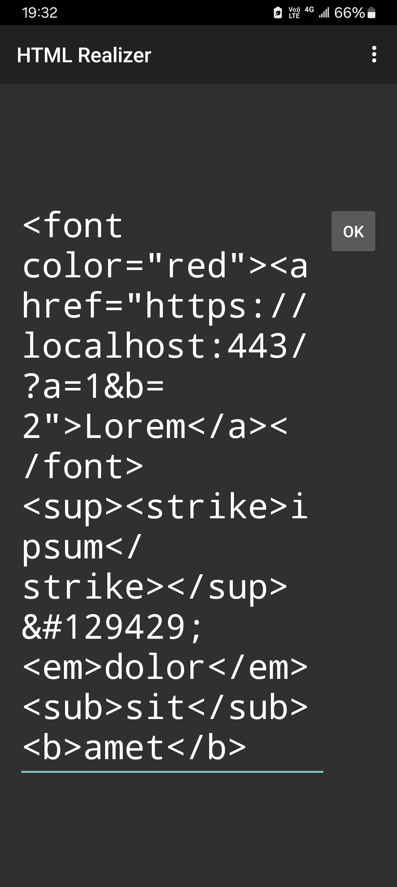
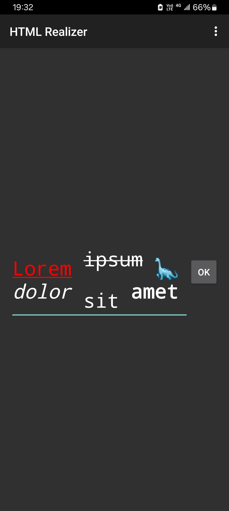

# HTML Realizer

This is an app that turns HTML (Hypertext Markup Language) code into styled text, which can then be edited or copied. However, the text's style might not be retained if it is pasted somewhere else. Whether or how the style will be kept depends on how much the other app supports it.

It is not this app, but the platform, that parses the code. Hence, there is currently no well-compiled list of supported tags.

### Screenshots

### Disclaimer

This app is not associated with the W3C nor with any organization that uses a logo similar to this app's icon. Nor is its author associated with any of the entities mentioned above.